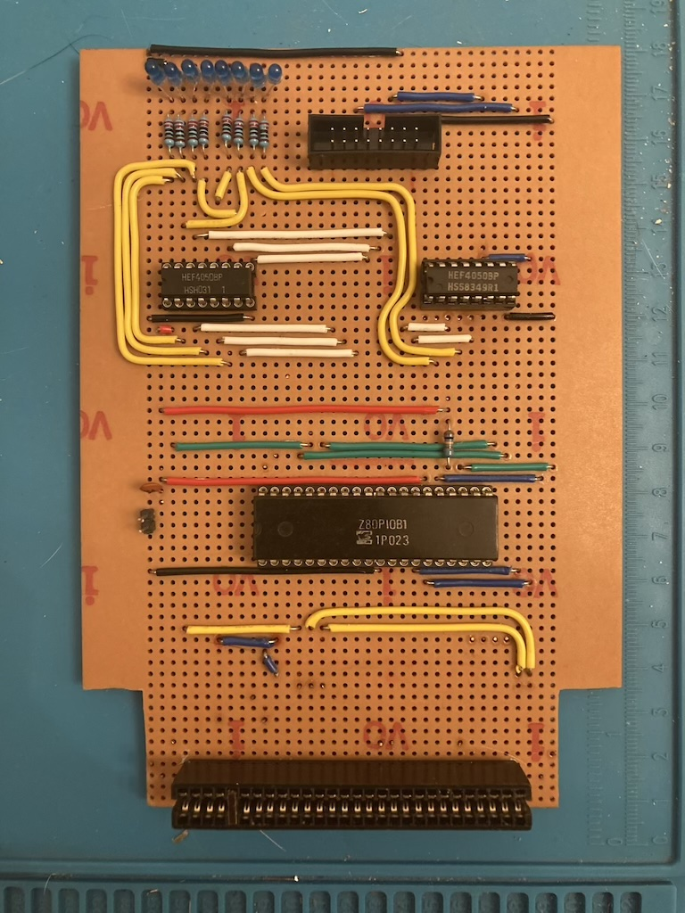

# Spectrum PIO Board

I’ve created a schematic for the stripboard on Fritzing as it is quite good at breadboard/stripboard layouts. This is loosely based upon a reference design in The Spectrum Hardware Manual by Adrian Dickens. I’ve added a couple of line drivers for the LEDs that are connected to the data and handshaking lines so that I don’t source too much current from its data lines.

The Fritzing file can be found [in this folder](./fritzing/).

## Schematic

## BOM

| Label         | Part Type                  | Description 
|---------------|----------------------------|------------
| IC1           | Z84C20                     | Z80 PIO
| IC2, IC3      | HEF4050B                   | Hex non-inverting buffer 
| J1            | 54-pin edge connector 0.1" | Spectrum edge connector
| J2            | 16-pin IDC connector       |
| LED3 to LED12 | 8                          | 
| C1            | 100nF                      | Decoupling capacitor for PIO
| R1            | 10kΩ resistor              | Pull-up for interrupt line
| R4 to R13     | 220kΩ resistor             | Current-limiting resistors for LEDs
|               | 16-way ribbon cable        | Female-to-female, around 80cm
|               | 36(w) x 50(h) stripboard   |

## Images

If you are thinking about building the Z80 PIO on stripboard, then here are some images of the front and rear, to give you an idea on how to route the wires. The LEDs I used were slightly wider than the 2.54mm pitch of the stripboard, so they are a bit splayed. I could have used smaller LEDs, but that was what I had in my parts box.

The LEDs are wired to the Z80 PIO via a couple of non-inverting hex buffers to mitigate the current draw on the PIOs. The original design also included LEDs for the two handshaking lines on the bottom two bits of Port A of the PIO. I have not wired these up yet.

The PIO requires a connection to the Z80 M1 line on the Spectrum. As far as I am aware it is only used to synchronise its interrupt logic. I’ve heard of Spectrums with faulty M1 lines that are incompatible with some peripherals (like DivMMC). As I don’t use interrupts in the bootloader code I think this will still work, though have not tested that scenario

The board does require (for Issue 1 and early Issue 2 boards) [this clock fix](http://www.breakintoprogram.co.uk/hardware/fixing-a-zx-spectrum-issue-2-clock-circuit), if it has not already been implemented.

### Front

There is a gap on the front of the board above the edge connector block – this is so that the board clears the Spectrum+/128K/+2/+3 case form factor. This is also why a number of the wires to the edge connector are routed on the rear of the board. My stripboard includes 4 bus lines either side – these are not required for the project and I had to make cutouts at the bottom to accomodate power (and RS232) sockets.

### Rear

