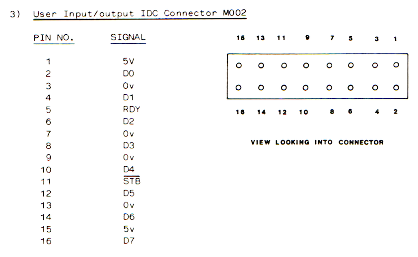

# tatung

The Tatung has a built-in User I/O port powered by a Z80 PIO. This is used by Mike Webb's editor/assembler to send data to the target machine.

It has the following pinout (looking at the rear of the connector)



The pins of interest are:

- The data pins D0-D7 (all the even pins on the bottom row)
- A ground (pin 3)
- The ready line (pin 5)
- The strobe line (pin 11)

## The Tatung Einstein User I/O Port

The Tatung uses a Z80 PIO to implement its parallel printer port (on PIO port A) and the user I/O port (on PIO port B). The port is unbuffered, connected directly to the Z80 PIO.

## The PIO functions in the Einstein editor/assembler

I was able to obtain the source for the editor from Kevin Edwards and quickly identified the code responsible for outputting data over the PIO

```
PCNT:    EQU 33H         ; Port B (User I/O) Control
PDATA:   EQU 32H         ; Port B (User I/O) Data
INTVECT: EQU 0FB12H      ; The Einstein IO interrupt vector       
 
; Initialise the PIO
;
INITPIO: LD A,0FH        ; Top 2 bits are 0 so Mode 0
         DI
         OUT (PCNT),A    ; Set the PIO port B control registor
         LD A,87H        ; Set the PIO port B interrupt mode (Enabled)
         OUT (PCNT),A
         LD HL,INTER     ; Set the Einstein interrupt vector
         LD (INTVECT),HL
         EI
         RET
 
; The interrupt
; This will be called after the Spectrum has pulled the strobe from low to high
;
INTER:   PUSH HL
         LD HL,INTFLAG   ; Set the interrupt flag to indicate data sent
         SET 0,(HL)
         POP HL
         EI
         RETI
 
; Output a byte to the PIO
; Parameters:
; - A: The data
; Returns:
; - F: Carry set if aborted, otherwise reset
;
PPBYTE:  PUSH AF         ; Stack the data
         XOR A           ; Clear the interrupt flag
         LD (INTFLAG),A
         POP AF
         OUT (PDATA),A   ; Write out the data to the port
WAIT:    IN A,(20H)      ; Read the Einstein Aux register
         AND 20H         ; Check for Graph key
         JR Z,ABORT      ; If pressed, then abort transfer
         LD A,(INTFLAG)  ; Wait for the interrupt to indicate data sent
         OR A  
         JR Z,WAIT
         OR A            ; Clear the carry flag (OK)
         RET
 
; Abort
;
ABORT:   LD A,3
         OUT (PDATA),A   ; Signal bootloader to abort (in waiting for header loop)
         SCF             ; Set the carry flag (abort)
         RET
```

The Tatung uses PIO Mode 0 (Output). This mode utilises two handshaking lines in addition to the 8 data lines: Strobe and Ready.

When the Einstein writes data to the port, the port’s ready line will be pulled high
An interrupt will occur when the strobe line is pulled high by the recipient

## The data format

The data sent by Mike Webb's assembler is preceded by a header in the following format. Words are little-endian:

- 4 byte: Header [1, 1, 1, 0]
- 1 word: Start address
- 1 word: Length

This is then followed by the data block of the specified length that contains the assembled binary.

The bootloader must wait for the data packet in the specified format and load it to the specified address.

```
Loop three times {
  Abort if anything other than a one comes in
}
Read the next byte {
  Abort if not zero
}
The next word is the start address
The next word is the length
Loop length times {
  Read a byte in
  Store at the address and increment it by one
}
```