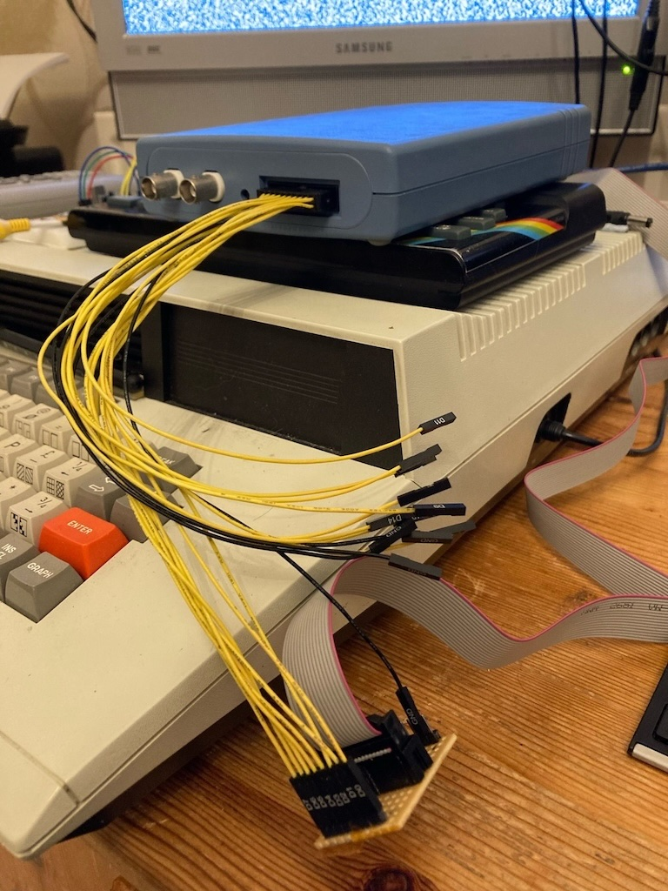

# tests

To test the board I used a Picoscope 2205A MSO. I built a small breakout board on stripboard so that I could more easily connect the probes to the ribbon cable.



## Tatung test code

The PIO on the Tatung can be tested with the following BBC BASIC for Z80 program. It counts from 0 to 255 and outputs the value to the User I/O port.

```
10 PUT &33,&CF     : REM Set the I/O port to mode 3
20 PUT &33,0       : REM Set all 8 pins to output
30 FOR A%=0 TO 255 
40   PUT &32,A%    : REM Output the value on Port B
50 PRINT A%
60 NEXT
70 GOTO 30
```

Connect an oscilloscope to the data lines and they should be counting up in binary.

### Spectrum test code

The PIO on the Spectrum board can be tested with the following Sinclair BASIC program. It configures both ports and will output all the values on the data and handshaking lines.

If you have installed the LEDs then this should light the LEDs, otherwise use an oscilloscope to test.

```
100 REM Set Port B to Mode 3 and all pins to output
110 :
120 OUT 127, BIN 11001111
130 OUT 127, BIN 00000000
140 :
150 REM Set Port A to Mode 3 and pins 0 and 1 to output
160 :
170 OUT 95, BIN 11001111
180 OUT 95, BIN 11111100
190 :
200 REM Loop and output the data
210 :
220 FOR b=0 TO 255
230 OUT 63, b : REM The data byte
240 FOR a=0 TO 3
250 OUT 31, a : REM The handshaking bits 
260 NEXT a
270 NEXT b
280 GOTO 220
```